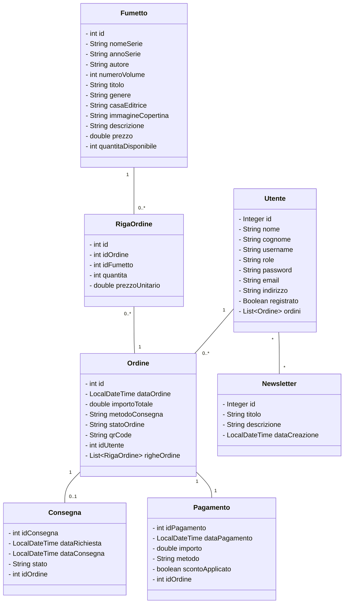

```mermaid
classDiagram
    subgraph entity
        class Fumetto {
            - int id
            - String nomeSerie
            - String annoSerie
            - String autore
            - int numeroVolume
            - String titolo
            - String genere
            - String casaEditrice
            - String immagineCopertina
            - String descrizione
            - double prezzo
            - int quantitaDisponibile
        }

        class RigaOrdine {
            - int id
            - int idOrdine
            - int idFumetto
            - int quantita
            - double prezzoUnitario
        }

        class Ordine {
            - int id
            - LocalDateTime dataOrdine
            - double importoTotale
            - String metodoConsegna
            - String statoOrdine
            - String qrCode
            - int idUtente
            - List~RigaOrdine~ righeOrdine
        }

        class Consegna {
            - int idConsegna
            - LocalDateTime dataRichiesta
            - LocalDateTime dataConsegna
            - String stato
            - int idOrdine
        }

        class Pagamento {
            - int idPagamento
            - LocalDateTime dataPagamento
            - double importo
            - String metodo
            - boolean scontoApplicato
            - int idOrdine
        }

        class Utente {
            - Integer id
            - String nome
            - String cognome
            - String username
            - String role
            - String password
            - String email
            - String indirizzo
            - Boolean registrato
            - List~Ordine~ ordini
        }

        class Newsletter {
            - Integer id
            - String titolo
            - String descrizione
            - LocalDateTime dataCreazione
        }
    end

    Fumetto "1" -- "0..*" RigaOrdine
    RigaOrdine "0..*" -- "1" Ordine
    Ordine "1" -- "0..1" Consegna
    Ordine "1" -- "1" Pagamento
    Utente "1" -- "0..*" Ordine
    Utente "*" -- "*" Newsletter


```
