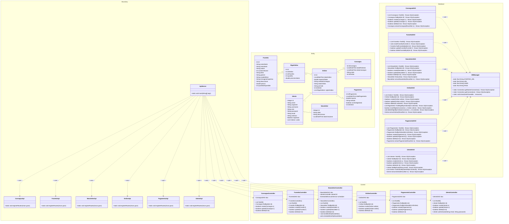

```mermaid
classDiagram
    namespace Boundary {
        class ApiServer {
            +static void main(String[] args)
        }
        class ConsegnaApi {
            +static void registerRoutes(Gson gson)
        }
        class FumettoApi {
            +static void registerRoutes(Gson gson)
        }
        class NewsletterApi {
            +static void registerRoutes(Gson gson)
        }
        class OrdineApi {
            +static void registerRoutes(Gson gson)
        }
        class PagamentoApi {
            +static void registerRoutes(Gson gson)
        }
        class UtenteApi {
            +static void registerRoutes(Gson gson)
        }
    }

    namespace Control {
        class ConsegnaController {
            - ConsegnaDAO dao
            + List<Consegna> findAll()
            + Consegna findById(int id)
            + boolean create(Consegna c)
            + boolean update(Consegna c)
            + boolean delete(int id)
        }
        class FumettoController {
            - FumettoDAO dao
            + FumettoController()
            + List<Fumetto> findAll()
            + Fumetto findById(int id)
            + boolean create(Fumetto f)
            + boolean update(Fumetto f)
            + boolean delete(int id)
        }
        class NewsletterController {
            - NewsletterDAO dao
            - UtenteController utenteCtrl
            - ScheduledExecutorService scheduler
            + NewsletterController()
            + List<Newsletter> findAll()
            + Newsletter findById(int id)
            + boolean create(Newsletter n)
            + boolean update(Newsletter n)
            + boolean delete(int id)
            + void sendMonthlyNewsletter()
            - void scheduleMonthlyNewsletter()
        }
        class OrdineController {
            - OrdineDAO dao
            + List<Ordine> findAll()
            + Ordine findById(int id)
            + boolean create(Ordine ordine)
            + boolean update(Ordine ordine)
            + boolean delete(int id)
        }
        class PagamentoController {
            - PagamentoDAO dao
            + List<Pagamento> findAll()
            + Pagamento findById(int id)
            + Pagamento findByOrdineId(int idOrdine)
            + boolean create(Pagamento p)
            + boolean update(Pagamento p)
            + boolean delete(int id)
        }
        class UtenteController {
            - UtenteDAO dao
            + List<Utente> findAll()
            + Utente findById(int id)
            + boolean create(Utente u)
            + boolean update(Utente u)
            + boolean delete(int id)
            + Utente authenticate(String email, String password)
        }
    }

    namespace Entity {
        class Fumetto {
            - int id
            - String nomeSerie
            - String annoSerie
            - String autore
            - int numeroVolume
            - String titolo
            - String genere
            - String casaEditrice
            - String immagineCopertina
            - String descrizione
            - double prezzo
            - int quantitaDisponibile
        }
        class RigaOrdine {
            - int id
            - int idOrdine
            - int idFumetto
            - int quantita
            - double prezzoUnitario
        }
        class Ordine {
            - int id
            - LocalDateTime dataOrdine
            - double importoTotale
            - String metodoConsegna
            - String statoOrdine
            - String qrCode
            - int idUtente
            - List~RigaOrdine~ righeOrdine
        }
        class Consegna {
            - int idConsegna
            - LocalDateTime dataRichiesta
            - LocalDateTime dataConsegna
            - String stato
            - int idOrdine
        }
        class Pagamento {
            - int idPagamento
            - LocalDateTime dataPagamento
            - double importo
            - String metodo
            - boolean scontoApplicato
            - int idOrdine
        }
        class Utente {
            - Integer id
            - String nome
            - String cognome
            - String username
            - String role
            - String password
            - String email
            - String indirizzo
            - Boolean registrato
            - List~Ordine~ ordini
        }
        class Newsletter {
            - Integer id
            - String titolo
            - String descrizione
            - LocalDateTime dataCreazione
        }
    }

    namespace Database {
        class DBManager {
            - static final String STARTER_URL
            - static final String URL
            - static final String USER
            - static final String PASS
            + static Connection getStarterConnection() throws SQLException
            + static Connection getConnection() throws SQLException
            + static void close(AutoCloseable... resources)
        }
        class ConsegnaDAO {
            + List~Consegna~ findAll() throws SQLException
            + Consegna findById(int id) throws SQLException
            + boolean create(Consegna c) throws SQLException
            + boolean update(Consegna c) throws SQLException
            + boolean delete(int id) throws SQLException
            - Consegna extractConsegna(ResultSet rs) throws SQLException
        }
        class FumettoDAO {
            + List~Fumetto~ findAll() throws SQLException
            + void createFumetto(Fumetto f) throws SQLException
            + Fumetto findFumettoById(int id) throws SQLException
            + boolean updateFumetto(Fumetto f) throws SQLException
            + boolean deleteFumettoById(int id) throws SQLException
        }
        class NewsletterDAO {
            + List~Newsletter~ findAll() throws SQLException
            + Newsletter findById(int id) throws SQLException
            + boolean create(Newsletter n) throws SQLException
            + boolean update(Newsletter n) throws SQLException
            + boolean delete(int id) throws SQLException
            + Newsletter findLatest() throws SQLException
            - Newsletter extractNewsletter(ResultSet rs) throws SQLException
        }
        class OrdineDAO {
            + List~Ordine~ findAll() throws SQLException
            + Ordine findById(int id) throws SQLException
            + boolean create(Ordine ordine) throws SQLException
            + boolean update(Ordine ordine) throws SQLException
            + boolean delete(int ordineId) throws SQLException
            - List~RigaOrdine~ findRigheByOrdineId(int ordineId) throws SQLException
            - boolean insertRighe(Connection c, Ordine ordine) throws SQLException
            - void deleteRigheByOrdine(Connection c, int ordineId) throws SQLException
            - Ordine extractOrdine(ResultSet rs) throws SQLException
        }
        class PagamentoDAO {
            + List~Pagamento~ findAll() throws SQLException
            + Pagamento findById(int id) throws SQLException
            + Pagamento findByOrdineId(int idOrdine) throws SQLException
            + boolean create(Pagamento p) throws SQLException
            + boolean update(Pagamento p) throws SQLException
            + boolean delete(int id) throws SQLException
            - Pagamento extractPagamento(ResultSet rs) throws SQLException
        }
        class UtenteDAO {
            + List~Utente~ findAll() throws SQLException
            + Utente findById(int id) throws SQLException
            + boolean create(Utente u) throws SQLException
            + boolean update(Utente u) throws SQLException
            + boolean delete(int id) throws SQLException
            + Utente findByEmail(String email) throws SQLException
            - List~Ordine~ findOrdiniByUtenteId(int idUtente) throws SQLException
            - Utente extractUtente(ResultSet rs) throws SQLException
        }
    }

    %% Entity Relationships
    Fumetto "1" -- "0..*" RigaOrdine
    RigaOrdine "0..*" -- "1" Ordine
    Ordine "1" -- "0..1" Consegna
    Ordine "1" -- "1" Pagamento
    Utente "1" -- "0..*" Ordine
    Utente "*" -- "*" Newsletter

    %% <<use>> relationships
    ApiServer ..> ConsegnaApi    : ~~use~~
    ApiServer ..> FumettoApi      : ~~use~~
    ApiServer ..> NewsletterApi   : ~~use~~
    ApiServer ..> OrdineApi       : ~~use~~
    ApiServer ..> PagamentoApi    : ~~use~~
    ApiServer ..> UtenteApi       : ~~use~~

    ApiServer ..> ConsegnaController    : ~~use~~
    ApiServer ..> FumettoController     : ~~use~~
    ApiServer ..> NewsletterController : ~~use~~
    ApiServer ..> OrdineController      : ~~use~~
    ApiServer ..> PagamentoController   : ~~use~~
    ApiServer ..> UtenteController      : ~~use~~

    ConsegnaDAO    ..> DBManager : ~~use~~
    FumettoDAO      ..> DBManager : ~~use~~
    NewsletterDAO   ..> DBManager : ~~use~~
    OrdineDAO       ..> DBManager : ~~use~~
    PagamentoDAO    ..> DBManager : ~~use~~
    UtenteDAO       ..> DBManager : ~~use~~

```
